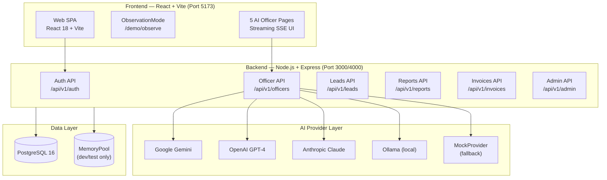

# EduFlow AI OS — System Overview

## What It Is
EduFlow AI OS is an AI-powered administrative automation platform for Indian educational institutions. It deploys five specialized AI Officers (Accreditation, Timetable, Admissions, Finance, Student Success) that generate NAAC/NBA accreditation reports, predict student dropout risk, automate timetable scheduling, and streamline administrative workflows — all via a real-time streaming interface backed by live LLM integration (Gemini, OpenAI, Claude, Ollama).

## What It Is NOT
EduFlow AI OS is NOT a traditional ERP, NOT a chatbot wrapper, and NOT a no-code platform builder. It does not replace faculty or administrators — it generates structured outputs that administrators review and act on. It has no built-in student-facing modules for actual coursework delivery.

## System Topology

## Feature Status Matrix

| Feature | Status | Notes |
|---|---|---|
| JWT Authentication + bcrypt | ✅ Working | Role-based: admin, faculty, student, parent |
| Institution Registration | ✅ Working | Multi-tenant, short_code unique |
| Accreditation Officer (SSE stream) | ✅ Working | Real LLM output via Gemini/OpenAI |
| Student Success Officer (SSE stream) | ✅ Working | Dropout risk prediction |
| Timetable Officer (SSE stream) | ✅ Working | Conflict-free scheduling |
| Admissions Officer (SSE stream) | ✅ Working | Yield prediction |
| Finance Officer (SSE stream) | ✅ Working | Fee reconciliation |
| AI Terminal | ✅ Working | Multi-provider chat |
| Audit Logs | ✅ Working | PostgreSQL-backed |
| Observation Mode | ✅ Working | Cinematic 5-step demo at /demo/observe |
| PDF Export (Officer Reports) | ✅ Working | Pure JS, no external deps |
| Lead Intake (/for-colleges) | ✅ Working | Honeypot anti-spam, Indian phone validation |
| Lead Management (Admin) | ✅ Working | Status pipeline, notes autosave |
| Report Delivery | ✅ Working | Secure token link + PDF download |
| Invoice Generator | ✅ Working | GST 18%, auto-numbered EDU-YYYY-XXXX |
| Error Boundaries | ✅ Working | All 5 officer pages wrapped |
| Production Rate Limiting | ✅ Working | 100 auth / 20 unauth per 15min |
| Backup System | ✅ Working | gzip, retention policy, restore script |
| Student Portal (70+ screens) | ⚠️ Mock | Hardcoded data, no real DB queries |
| Faculty Portal | ⚠️ Mock | Hardcoded data |
| Parent Portal | ⚠️ Mock | Hardcoded data |
| Payments / Razorpay | ❌ Not Built | Planned Phase 3 |
| WhatsApp / SMS Notifications | ❌ Not Built | Planned Phase 3 |
| OTP Login | ❌ Not Built | Planned Phase 3 |
| Mobile App | ❌ Placeholder | eduflow-core/mobile exists, not functional |
| Multi-tenant DB-level RLS | ❌ Planned | Currently application-level isolation |
| SOC2 Compliance | ❌ Planned | Phase 3 enterprise tier |

## Blueprint Index

| File | Description |
|---|---|
| [01-ARCHITECTURE.md](./01-ARCHITECTURE.md) | Full stack breakdown, microservice map |
| [02-DATA-FLOW.md](./02-DATA-FLOW.md) | Sequence diagrams for all major flows |
| [03-DATABASE-SCHEMA.md](./03-DATABASE-SCHEMA.md) | ER diagram, all tables, indexes |
| [04-API-CONTRACT.md](./04-API-CONTRACT.md) | All endpoints, request/response schemas |
| [05-AI-OFFICER-CONTRACTS.md](./05-AI-OFFICER-CONTRACTS.md) | Officer personas, ROI, failure modes |
| [06-DEMO-PLAYBOOK.md](./06-DEMO-PLAYBOOK.md) | 10-min demo script, recovery protocols |
| [07-DEPLOYMENT.md](./07-DEPLOYMENT.md) | Render, VPS, Docker deployment guides |
| [08-BUSINESS-MODEL.md](./08-BUSINESS-MODEL.md) | Pricing, unit economics, competition |
| [09-TESTING-STRATEGY.md](./09-TESTING-STRATEGY.md) | Test pyramid, coverage targets |
| [10-OBSERVABILITY.md](./10-OBSERVABILITY.md) | Logging, health endpoints, runbook |
| [11-TEST-GAPS.md](./11-TEST-GAPS.md) | Untested features, priority gaps |
| [12-MANUAL-QA-CHECKLIST.md](./12-MANUAL-QA-CHECKLIST.md) | 30-point pre-demo verification checklist |
