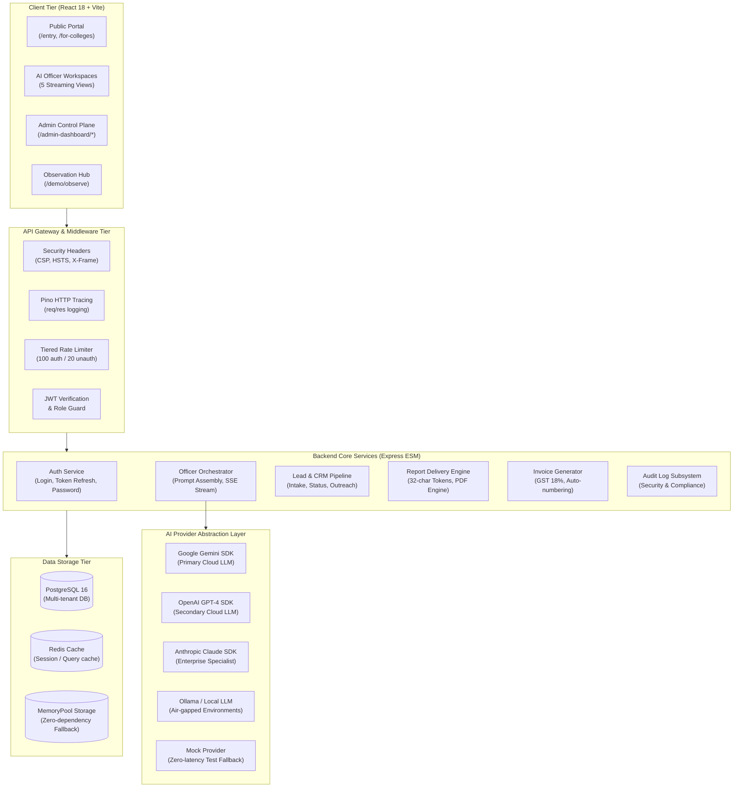
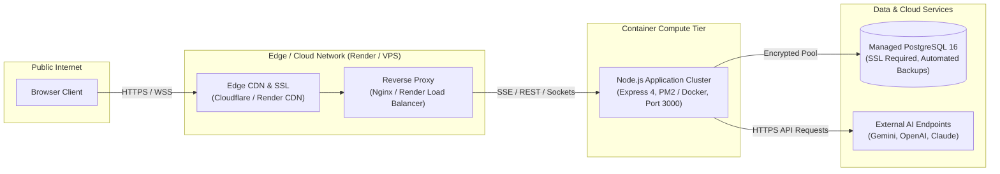

# EduFlow AI OS — System Architecture Blueprint

## 1. Technology Stack Overview

### Frontend Architecture
| Layer | Technology | Specification / Version | Rationale |
|---|---|---|---|
| Core Framework | React | 18.3.1 (SPA) | Declarative UI, extensive ecosystem, robust state model |
| Build Toolchain | Vite | 6.x | Instant HMR, roll-up based production code-splitting |
| Routing | React Router DOM | 6.x | Client-side routing, protected routes, declarative nested routes |
| UI Componentry | Bootstrap 5 + Vanilla CSS | Custom tokens + Dark Theme | Zero overhead, predictable layout, high performance |
| Motion & Animation | Framer Motion | 11.x | Cinematic transitions, streaming typewriter effects |
| Data Visualization | Chart.js & Recharts | 4.x / 2.x | Real-time ROI accumulation and metric analytics |
| Streaming Client | Custom SSE Hook | `useStreamingOfficer.js` | Native Fetch Streams API with AbortController lifecycle |
| Testing Stack | Vitest + Testing Library | React Testing Library | Fast in-memory unit and component testing |

### Backend Architecture
| Layer | Technology | Specification / Version | Rationale |
|---|---|---|---|
| Runtime | Node.js (ESM) | >= 20.0.0 (LTS) | Native fetch, modern async pipeline, ESM import/export |
| HTTP Web Framework | Express | 4.21.2 | Lightweight, stable, middleware-rich HTTP engine |
| Real-time WebSockets | Socket.IO | 4.8.3 | Live fleet GPS tracking and instant administrative broadcast |
| Authentication | jsonwebtoken & bcryptjs | JWT (15m access / 7d refresh) | Stateless token auth with salted 12-round password hashes |
| Input Validation | Zod | 3.25.76 | Runtime schema parsing with fail-fast strict validation |
| Structured Logging | Pino & pino-http | High-performance JSON | Low overhead structured JSON logging with request tracing |
| Rate Limiting | express-rate-limit | 7.5.1 | Production-grade tiered IP rate limiting with Retry-After headers |
| PDF Compilation | Native Binary Generator | Pure JS (%PDF-1.4 spec) | Zero-dependency, deterministic PDF generation without native binaries |
| Test Runner | node:test | Native Node test runner | Zero external test runner dependencies, native parallel suites |

### Data & Caching Architecture
| Layer | Technology | Specification | Fallback / Redundancy |
|---|---|---|---|
| Relational Storage | PostgreSQL 16 | ACID multi-tenant tables | In-memory `MemoryPool` mock for offline development |
| Vector Engine | pgvector | Extension | Embedding similarity search for institutional knowledge |
| In-Memory Cache | LRU-Cache & Redis | 4.6.12 | In-memory LRU with transparent Redis distributed fallback |

---

## 2. Microservice & Modular Subsystems

### Subsystems Implemented Today vs Planned
- **Implemented Today:**
  - `AuthService`: Full JWT authentication, bcrypt hash, role verification (`admin`, `faculty`, `student`, `parent`).
  - `AIOrchestrator`: Multi-provider abstraction factory with dynamic provider routing and SSE streaming.
  - `LeadService`: Public lead intake with honeypot spam protection and CRM pipeline stage transitions.
  - `ReportDelivery`: Cryptographically secure tokenized delivery with view counting and PDF compilation.
  - `InvoiceEngine`: GST-compliant PDF invoice creation with automated sequential numbers (`EDU-2026-XXXX`).
  - `BackupService`: Automated GZIP compressed backups with 30-day daily and 12-month retention management.
  - `AuditService`: Comprehensive event auditing with IP address, user agent, and contextual payload metadata.
- **Planned Enterprise Enhancements (Phase 4+):**
  - `WhatsAppNotificationService`: Direct template-based WhatsApp broadcast via Meta Cloud API.
  - `PaymentGateway`: Automated webhook-driven reconciliation with Razorpay/Stripe payment links.
  - `DB-Level RLS`: Native PostgreSQL Row Level Security policies replacing application-level filtering.

---

## 3. Production Deployment Topology

