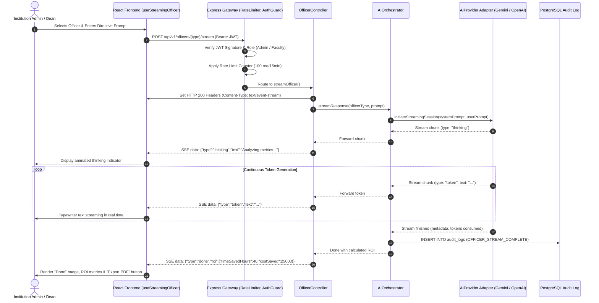
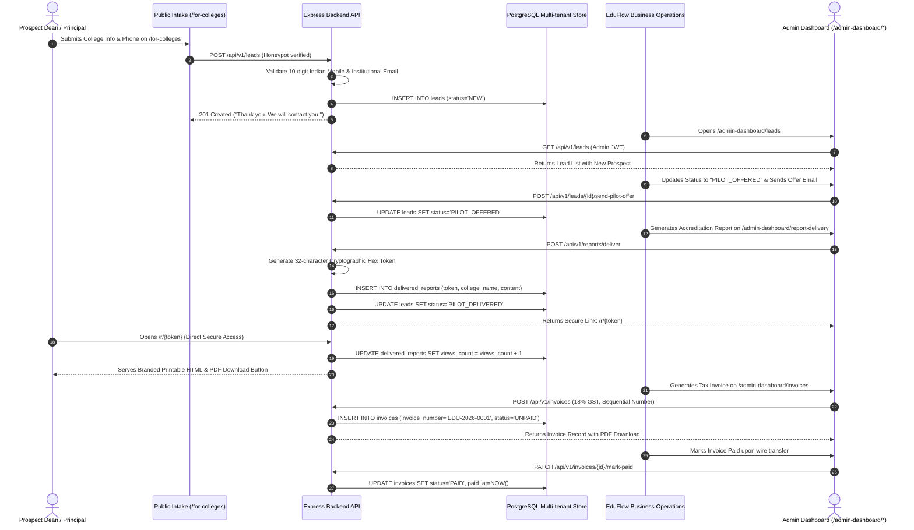

# EduFlow AI OS — System Data Flow & Sequence Blueprints

## 1. AI Officer Real-Time Streaming Sequence

```mermaid
sequenceDiagram
    autonumber
    actor Admin as Institution Admin / Dean
    participant Web as React Frontend (useStreamingOfficer)
    participant Gateway as Express Gateway (RateLimiter, AuthGuard)
    participant Controller as OfficerController
    participant Orchestrator as AIOrchestrator
    participant Adapter as AIProvider Adapter (Gemini / OpenAI)
    participant DB as PostgreSQL Audit Log

    Admin->>Web: Selects Officer & Enters Directive Prompt
    Web->>Gateway: POST /api/v1/officers/{type}/stream (Bearer JWT)
    Gateway->>Gateway: Verify JWT Signature & Role (Admin / Faculty)
    Gateway->>Gateway: Apply Rate Limit Counter (100 req/15min)
    Gateway->>Controller: Route to streamOfficer()
    Controller->>Web: Set HTTP 200 Headers (Content-Type: text/event-stream)
    Controller->>Orchestrator: streamResponse(officerType, prompt)
    Orchestrator->>Adapter: initiateStreamingSession(systemPrompt, userPrompt)
    Adapter-->>Orchestrator: Stream chunk (type: "thinking")
    Orchestrator-->>Controller: Forward chunk
    Controller-->>Web: SSE data: {"type":"thinking","text":"Analyzing metrics..."}
    Web->>Admin: Display animated thinking indicator
    loop Continuous Token Generation
        Adapter-->>Orchestrator: Stream chunk (type: "token", text: "...")
        Orchestrator-->>Controller: Forward token
        Controller-->>Web: SSE data: {"type":"token","text":"..."}
        Web->>Admin: Typewriter text streaming in real time
    end
    Adapter-->>Orchestrator: Stream finished (metadata, tokens consumed)
    Orchestrator->>DB: INSERT INTO audit_logs (OFFICER_STREAM_COMPLETE)
    Orchestrator-->>Controller: Done with calculated ROI
    Controller-->>Web: SSE data: {"type":"done","roi":{"timeSavedHours":40,"costSaved":25000}}
    Web->>Admin: Render "Done" badge, ROI metrics & "Export PDF" button
```

---

## 2. Automation Business Flow (Lead → Pilot → Delivery → Invoice)

```mermaid
sequenceDiagram
    autonumber
    actor Dean as Prospect Dean / Principal
    participant PublicWeb as Public Intake (/for-colleges)
    participant Backend as Express Backend API
    participant DB as PostgreSQL Multi-tenant Store
    participant AdminUser as EduFlow Business Operations
    actor AdminUI as Admin Dashboard (/admin-dashboard/*)

    Dean->>PublicWeb: Submits College Info & Phone on /for-colleges
    PublicWeb->>Backend: POST /api/v1/leads (Honeypot verified)
    Backend->>Backend: Validate 10-digit Indian Mobile & Institutional Email
    Backend->>DB: INSERT INTO leads (status='NEW')
    Backend-->>PublicWeb: 201 Created ("Thank you. We will contact you.")
    
    AdminUser->>AdminUI: Opens /admin-dashboard/leads
    AdminUI->>Backend: GET /api/v1/leads (Admin JWT)
    Backend-->>AdminUI: Returns Lead List with New Prospect
    AdminUser->>AdminUI: Updates Status to "PILOT_OFFERED" & Sends Offer Email
    AdminUI->>Backend: POST /api/v1/leads/{id}/send-pilot-offer
    Backend->>DB: UPDATE leads SET status='PILOT_OFFERED'
    
    AdminUser->>AdminUI: Generates Accreditation Report on /admin-dashboard/report-delivery
    AdminUI->>Backend: POST /api/v1/reports/deliver
    Backend->>Backend: Generate 32-character Cryptographic Hex Token
    Backend->>DB: INSERT INTO delivered_reports (token, college_name, content)
    Backend->>DB: UPDATE leads SET status='PILOT_DELIVERED'
    Backend-->>AdminUI: Returns Secure Link: /r/{token}
    
    Dean->>Backend: Opens /r/{token} (Direct Secure Access)
    Backend->>DB: UPDATE delivered_reports SET views_count = views_count + 1
    Backend-->>Dean: Serves Branded Printable HTML & PDF Download Button
    
    AdminUser->>AdminUI: Generates Tax Invoice on /admin-dashboard/invoices
    AdminUI->>Backend: POST /api/v1/invoices (18% GST, Sequential Number)
    Backend->>DB: INSERT INTO invoices (invoice_number='EDU-2026-0001', status='UNPAID')
    Backend-->>AdminUI: Returns Invoice Record with PDF Download
    AdminUser->>AdminUI: Marks Invoice Paid upon wire transfer
    AdminUI->>Backend: PATCH /api/v1/invoices/{id}/mark-paid
    Backend->>DB: UPDATE invoices SET status='PAID', paid_at=NOW()
```
