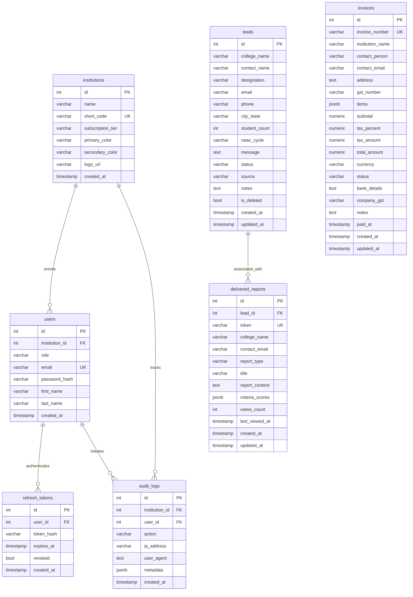

# EduFlow AI OS — Database Schema & Entity Relationships

## 1. Complete Entity-Relationship Diagram

## 2. Table Definitions & Multi-Tenant Strategy

### Multi-Tenancy Design Pattern
- **Current Architecture:** Application-level multi-tenancy. Every tenant query explicitly scopes against `institution_id` extracted from verified JWT claims.
- **Future Roadmap:** Migration to native PostgreSQL Row-Level Security (`ALTER TABLE ... ENABLE ROW LEVEL SECURITY`) with connection-scoped session variables (`SET app.current_institution_id = ...`).
